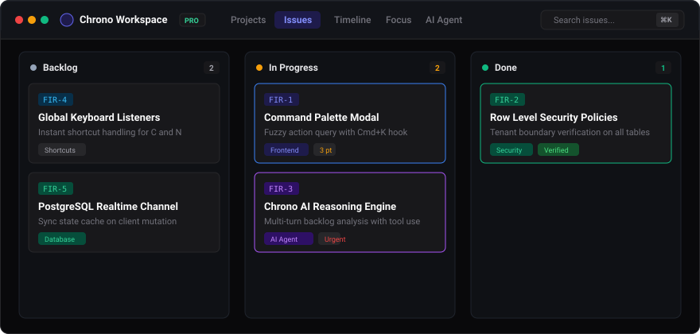
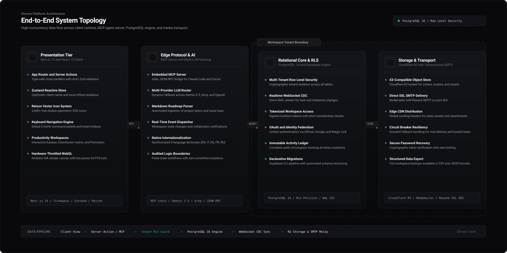

<p align="left">
  
</p>

<p align="left">
  
  
  
  
  
  
  
</p>

Chrono is a self-hostable workspace for software engineering teams that unifies issue tracking, milestone roadmaps, and personal focus tools in one cohesive interface. Built with Next.js 15, TypeScript, and Supabase, Chrono delivers a keyboard-first workflow with real time state replication, offline resilience, and strict database level isolation across organizations.

<p align="left">
  
</p>

##  The Platform

At its core, Chrono handles daily task planning through interactive Kanban boards and dense backlog views. Issues receive sequential alphanumeric identifiers, priority weights, point estimates, target deadlines, and full Markdown descriptions. An immutable activity log records property changes with author timestamps, while a slide out drawer lets developers modify tasks without losing their place on the board. Everything is navigable through a global command palette available via Cmd+K or Ctrl+K.

Beyond basic task management, the platform bridges high-level roadmaps with day-to-day execution. Engineering initiatives are broken down into milestones with automatic progress tracking calculated from resolved issues. For personal time management, Chrono incorporates a four quadrant Eisenhower matrix to separate urgent firefighting from long term goals, a weekly habit tracker to sustain routine engineering practices, and an integrated Pomodoro timer tied directly to active tickets.

For external tooling, Chrono ships with an embedded Model Context Protocol server that exposes issues and workspace state to local AI agents such as Claude Desktop or Cursor. Teams can interact with conversational models like Google Gemini, OpenAI, or Groq for automated backlog triage, import complete multi-project roadmaps directly from structured Markdown documents, and switch between five built in languages covering English, Italian, German, French, and Russian.

##  AI-Assisted Codebase and Security Audit

During early prototyping phases, parts of the codebase were generated with artificial intelligence assistance to explore component compositions and data structures quickly. Before releasing Chrono as open source, every schema definition, API endpoint, and state machine was manually reviewed, refactored, and audited by human engineers. All PostgreSQL tables are strictly guarded by Row Level Security policies, runtime inputs pass through Zod validation, and TypeScript runs in strict mode across the entire repository to prevent data leakage and logic defects.

##  Architecture and Tenant Isolation

Chrono implements a strict multi-tenant model directly inside PostgreSQL on Supabase. Each workspace represents an isolated boundary. Memberships, projects, issue records, labels, notifications, and storage objects are verified at the database layer on every query. Users can never view or modify data outside their active workspace memberships.

<p align="left">
  
</p>

##  Getting Started

Running Chrono requires Node.js version 18.18 or higher, npm or pnpm, and an active Supabase project instance either on Supabase Cloud or through the local Supabase CLI.

First clone the repository and navigate into the project directory.

```bash
git clone https://github.com/cristianobleve/chrono.git
cd chrono
```

Install the dependencies.

```bash
npm install
```

Create your local environment file by copying the example configuration.

```bash
cp .env.example .env.local
```

##  Environment Configuration

Configure your credentials and database connection details inside the `.env.local` file.

| Variable | Required | Description |
| --- | --- | --- |
| `NEXT_PUBLIC_SUPABASE_URL` | Yes | HTTPS endpoint of the Supabase project |
| `NEXT_PUBLIC_SUPABASE_ANON_KEY` | Yes | Anonymous public key for client side Supabase requests |
| `SUPABASE_URL` | Yes | Supabase endpoint used by server side route handlers |
| `SUPABASE_SECRET_KEY` | Yes | Administrative service key for privileged backend operations |
| `DATABASE_URL` | Optional | Direct PostgreSQL connection string or local fallback |
| `GEMINI_API_KEY` | Optional | Google AI Studio API key used by the workspace agent |
| `OPENAI_API_KEY` | Optional | OpenAI API key for alternative LLM providers |
| `GROQ_API_KEY` | Optional | Groq API key for low latency model inference |
| `R2_BUCKET_NAME` | Optional | S3 or Cloudflare R2 bucket name for file attachments |
| `R2_PUBLIC_DOMAIN` | Optional | Public CDN domain for uploaded media assets |

##  Supabase Database Setup

All database tables, performance indexes, and access control policies live in the `supabase/migrations/` directory.

To apply all migrations with the Supabase CLI, run the database push command.

```bash
npx supabase db push
```

Alternatively you can paste the migration files into the Supabase SQL Editor in numerical order, beginning with the base schema and proceeding through indexes, security policies, invitations, and notifications.

In the Supabase Authentication dashboard, enable the Email provider. Under URL Configuration, configure your primary domain in the Site URL field, such as `http://localhost:3000` during local development. Add appropriate wildcards to the Redirect URLs list, including `http://localhost:3000/**` and your production URL. If you want GitHub or Google login, configure the OAuth keys in the respective provider settings.

##  Available Scripts

| Script | Purpose |
| --- | --- |
| `npm run dev` | Starts the local development server with fast refresh |
| `npm run build` | Compiles the production application with strict type checking |
| `npm run start` | Boots the compiled Next.js production build |
| `npm run lint` | Executes static code analysis with ESLint |

##  License

Chrono is open source software released under the MIT License.
